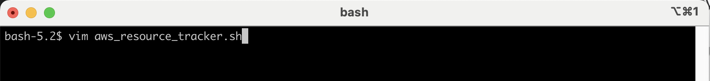
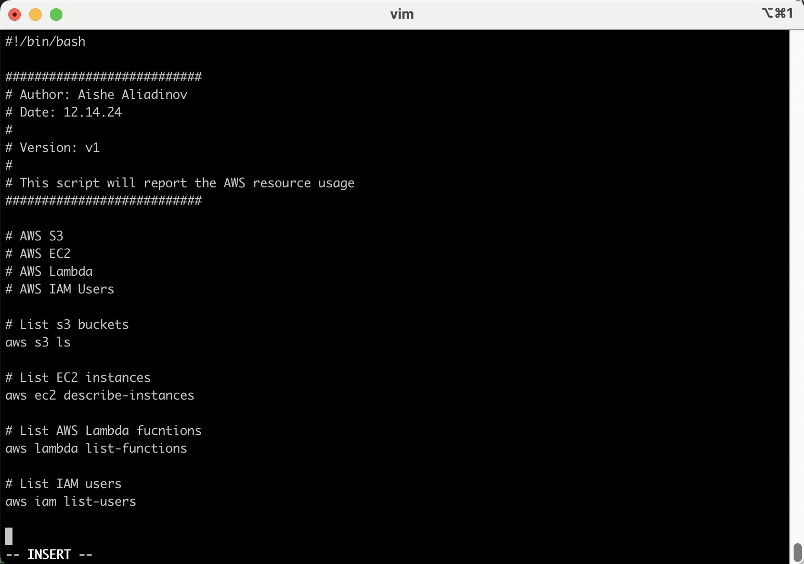
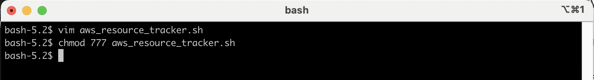
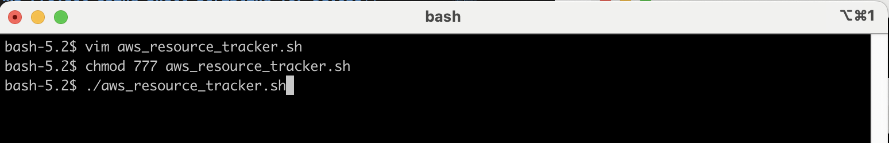
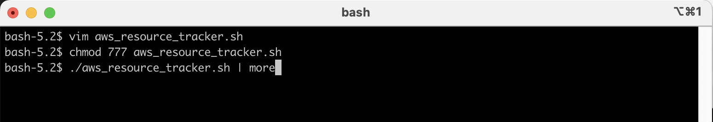
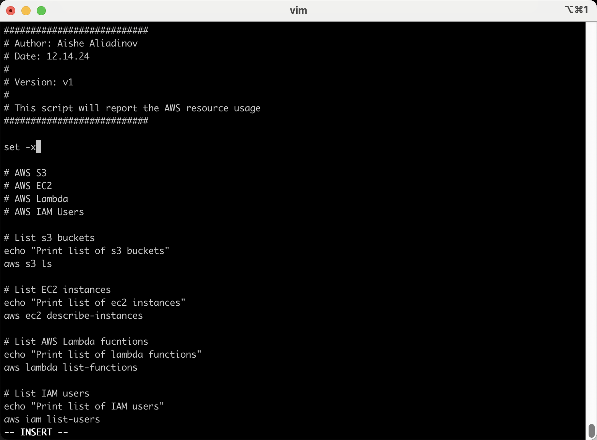
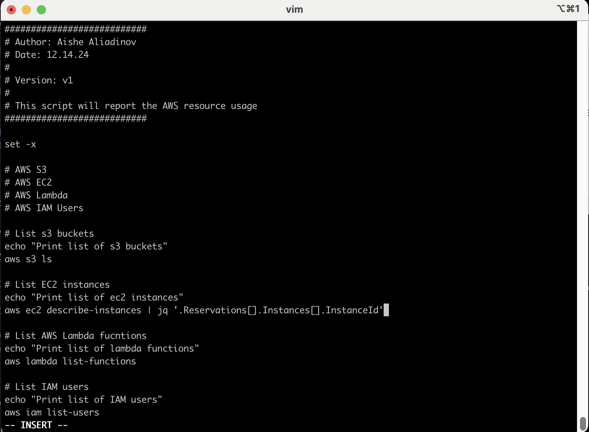
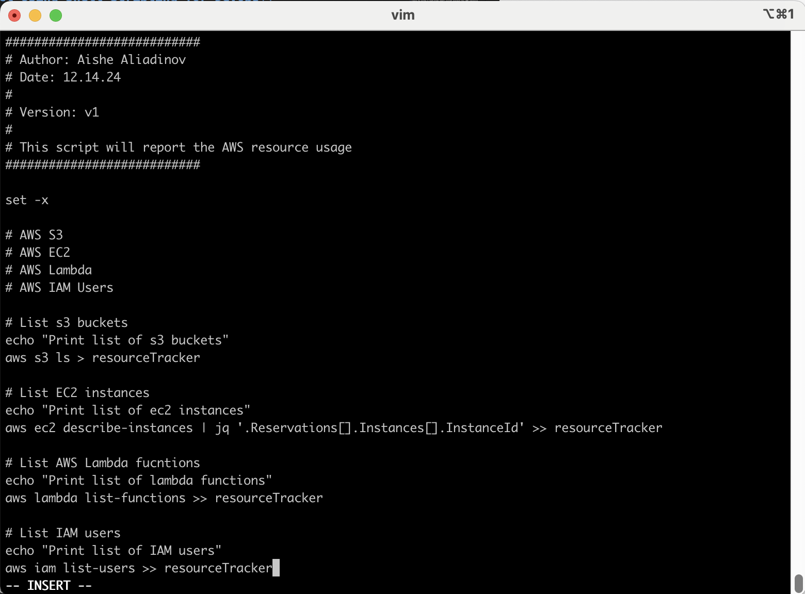
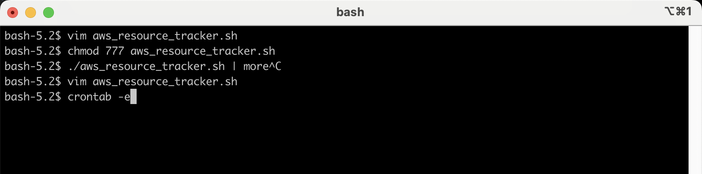
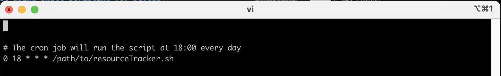

# Live AWS Project Using Shell Scripting for DevOps**

---

## **Introduction**
- **Project Overview:**
  - Learn to write a real-time shell script project for AWS resource tracking.
  - Use AWS CLI combined with shell scripting for practical applications.
- **Objective:**
  - Automate AWS resource monitoring for cost-effectiveness.
  - Generate daily reports on resource usage.
  - Integrate the script with a cron job for scheduled execution.

---

## **1. Why Move to Cloud Infrastructure?**
### **Key Benefits**
1. **Manageability:**
   - No need for maintaining physical servers or data centers.
   - Reduces maintenance overhead (e.g., patching, upgrades).
2. **Cost-Effectiveness:**
   - **Pay-as-you-go** model:
     - Charges only for resources actively in use.
     - Avoids costs for unused infrastructure.

### **Common Problems**
- Developers may create unused resources (e.g., EC2 instances, EBS volumes) that incur costs.
- Organizations need to track and optimize AWS resource usage to minimize expenses.

---

## **2. Project Overview**
### **Goal:**
- Monitor AWS resources daily and generate a usage report.
- Track the following AWS services:
  - **EC2 instances.**
  - **S3 buckets.**
  - **Lambda functions.**
  - **IAM users.**

### **Output:**
- The script generates a file summarizing:
  - Total number of active resources in each category.
  - Details like instance IDs, bucket names, etc.

### **Use Case:**
- As a DevOps every day at certain time, I need to give the usage report to a manager. Or usually this kind of information is supplied to a reporting dashboard.
- This info is provided by writing a shell script. This file will have the resources usage report.
- This shell script is integrated with cron job. 

---

## **3. Automating the Script**
### **Cron Job Integration**
- Automate daily execution of the shell script at a specified time (e.g., 6 PM).
- **What is a cron job?**
  - A Linux utility to schedule script execution at specific intervals.
  - Example:
    - Automating the publishing of a video at 7 PM on YouTube.

### **Benefits:**
- Avoids manual execution.
- Ensures timely generation of resource usage reports.

---

## **4. Prerequisites**
1. **AWS CLI Installed:**
   - Verify installation:
     ```bash
     aws --version
     ```
   - Configure AWS CLI:
     ```bash
     aws configure
     ```
     - Provide:
       - Access Key ID.
       - Secret Access Key.
       - Default region (e.g., `us-east-1`).
       - Output format (e.g., `json`).

2. **Bash Shell:**
   - Use Bash for scripting (preferred for Linux environments).
   - Ensure credentials and AWS CLI are correctly configured.

---

## **5. Writing the Script**
### **Script File:**
- File name: `aws_resource_tracker.sh`
- Steps:
  1. **Create the file:**
     ```bash
     touch aws_resource_tracker.sh
     chmod 777 aws_resource_tracker.sh
     ```
  2. **Add Metadata:**
     ```bash
     #!/bin/bash
     # Author: Abhishek
     # Date: 11th Jan
     # Version: v1
     # Purpose: Reports AWS resource usage.
     ```

### **Track AWS Resources**
1. **List S3 Buckets:**
   ```bash
   aws s3 ls











### Imrpoving the script:
**Add Print Statements (`echo`):**
- Provide debug information and labels for each section

**Use Debugging (`set`):**
- Enable script debugging



**Simplify Output with `jq`:**
- Extract specific fields (e.g., instance IDs) from AWS CLI JSON output



**Redirect output of the commands into the file:**



### Integrating with Cron job:





- Do not start with `#!/bin/bash` in the crontab file.
- Optionally, specify the shell using `SHELL=/bin/bash` if needed.

